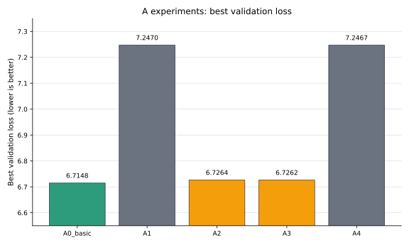
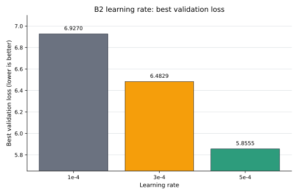
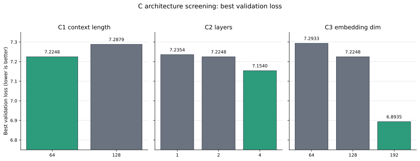
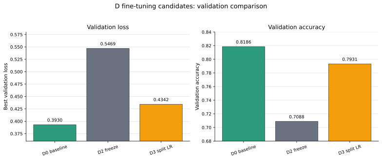
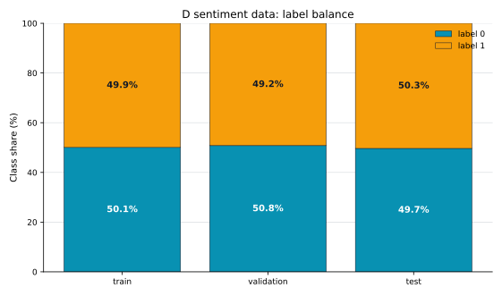

# mini GPT 구현 과제 보고서

이 보고서는 mini GPT 구현, NSMC 기반 사전 학습, 하이퍼파라미터 탐색, 감성 분류 fine-tuning 실험 결과를 종합한 최종 보고서다. A/B/C 사전 학습 및 구조 탐색 결과와 D 감성 분류 최종 결과를 모두 반영했다.

## 0. 반·팀원

| 항목 | 내용 |
| --- | --- |
| 반 | 303호 |
| 팀명 | 5팀 |
| 팀원 | 최영빈, 조범상, 임재환, 윤형민 |

---

## 1. 구현 현황

| 단계 | 구현 내용 | 구현 파일 | 담당자 |
| --- | --- | --- | --- |
| 1 | UTF-8 byte-level BPE tokenizer | `src/bpe.py` | 전 인원 |
| 2 | GPTDataset, create_dataloader, InputEmbedding | `src/dataset.py`, `src/embeddings.py` | 전 인원 |
| 3 | MultiHeadAttention, causal mask | `src/attention.py` | 전 인원 |
| 4 | LayerNorm, GELU, FeedForward, TransformerBlock, GPTModel, generate_text_simple | `src/model.py` | 전 인원 |
| 5 | loss 계산, checkpoint, generate, train_model | `src/train.py` | 전 인원 |
| 6 | NSMC 감성 분류 Dataset과 classifier | `src/finetune.py` | 전 인원 |
| 추가 | A/B/C/D 실험 runner와 결과 문서 | `experiments/scripts/`, `docs/EXPERIMENT_*.md` | 담당자별 |

---

## 2. 테스트 통과 현황

2026-06-03 로컬 환경에서 전체 테스트를 다시 실행했다.

| 실행 명령 | 결과 | 비고 |
| --- | --- | --- |
| `pytest tests/test_bpe.py -v` | 통과 | 전체 테스트에 포함 |
| `pytest tests/test_dataset.py -v` | 통과 | 전체 테스트에 포함 |
| `pytest tests/test_attention.py -v` | 통과 | 전체 테스트에 포함 |
| `pytest tests/test_model.py -v` | 통과 | 전체 테스트에 포함 |
| `pytest tests/test_train.py -v` | 통과 | 전체 테스트에 포함 |
| `pytest tests/test_finetune.py -v` | 통과 | 전체 테스트에 포함 |
| `pytest tests/ -q` | 통과 | 기본 구현 테스트 28개 + 팀 추가 테스트 2개 = 30 passed, 1 warning |

전체 30개 중 28개는 과제 기본 구현 검증 테스트이고, 2개는 팀 실험 인프라를 위해 추가한 산출물 저장 검증 테스트다.

| 구분 | 테스트 수 | 내용 |
| --- | ---: | --- |
| 기본 구현 테스트 | 28 | BPE, dataset, attention, model, train, finetune 기본 동작 검증 |
| 팀 추가 테스트 | 2 | metric JSONL과 latest/best checkpoint 저장 검증 |
| 합계 | 30 | 전체 통과 |

팀 추가 테스트는 `tests/test_train.py::TestStepArtifacts::test_train_model_writes_metrics_and_step_checkpoints`, `tests/test_finetune.py::TestSentimentTrainEval::test_train_sentiment_model_writes_step_artifacts`이다. 두 테스트는 Colab 또는 로컬 실험 중 metric/checkpoint 산출물이 남는지 확인하기 위해 추가했다.

경고는 `tests/test_train.py::TestPlotLosses::test_plot_losses_callable`에서 matplotlib non-interactive backend 관련 `UserWarning`이 1건 발생한 것이다. 테스트 실패는 없었다.

| 실패한 테스트 | 에러 요약 | 해결 시도 |
| --- | --- | --- |
| 없음 | - | - |

---

## 3. 데이터

| 항목 | 내용 |
| --- | --- |
| 원본 데이터 | NSMC |
| 원본 경로 | `data/ratings_train.txt`, `data/ratings_test.txt` |
| 사전 학습 데이터 | `data/nsmc_lm_train.txt`, `data/nsmc_lm_val.txt` |
| 미세 조정 데이터 | `data/nsmc_sentiment_train.jsonl`, `data/nsmc_sentiment_val.jsonl`, `data/nsmc_sentiment_test.jsonl` |
| 전처리 방식 | 빈 리뷰 제거, 공백 정리, LM train/validation 분리, 감성 분류 train/validation/test JSONL 생성 |
| 현재 로컬 LM train/val 크기 | train 1,417,311자, validation 123,849자 |
| 현재 로컬 sentiment row 수 | train 137,996개, validation 11,999개, test 49,997개 |
| sentiment label 비율 | train positive ratio 0.4994, validation 0.4921, test 0.5035 |
| Basic 사전 학습 기준 | `train_char_limit=1500000`, `vocab_size=3000`, `context_length=128` |

Basic 기준의 `train_char_limit=1500000`은 현재 LM train corpus 전체 길이보다 크므로, 실제로는 LM train corpus 전체를 사용하는 설정에 가깝다. 감성 분류 split은 모두 label 0/1 비율이 거의 50:50이어서 별도의 class imbalance 보정은 적용하지 않았다.

---

## 4. BPE

| 항목 | 내용 |
| --- | --- |
| 구현 파일 | `src/bpe.py` |
| BPE 방식 | UTF-8 byte-level BPE |
| 특수 토큰 ID | `<pad>=0`, `<unk>=1`, `<bos>=2`, `<eos>=3` |
| byte token ID 범위 | 4~259 |
| 공유 vocab_size | 3000 |
| 학습 corpus 크기 | 공식 실험에서는 전체 `data/nsmc_lm_train.txt` 기준 공유 tokenizer 사용 |
| 어휘 학습 시간 | 별도 수동 측정값 없음. 실험에서는 공유 tokenizer를 재사용 |
| vocabulary 저장 경로 | `artifacts/tokenizers/nsmc_bpe_vocab3000_full.json` |
| 인코딩/디코딩 검증 | `tests/test_bpe.py` 및 전체 테스트 통과 |

공유 tokenizer는 Drive 산출물이 아니라 Git repo의 `artifacts/tokenizers/` 아래에 두고, A/C Basic 또는 vocab3000 실험에서 동일한 vocabulary를 재사용했다.

---

## 5. 모델 구조

아래 값은 Basic baseline인 `A0_basic` 기준 모델 구조이다.

| 항목 | 내용 |
| --- | --- |
| 구현 파일 | `src/model.py` |
| 전체 구조 | InputEmbedding -> N x TransformerBlock -> LayerNorm -> LM head |
| vocab_size | 3000 |
| context_length | 128 |
| emb_dim | 128 |
| n_heads | 4 |
| n_layers | 2 |
| drop_rate | 0.1 |
| qkv_bias | False |
| 총 파라미터 수 | 1,180,160 |

C 실험에서는 구조 후보로 `n_layers=4`, `emb_dim=192`가 유망하게 나타났지만, 해당 값은 500k corpus 규모 screening 결과이며 Basic 최종 구조로 확정한 것은 아니다.

---

## 6. 사전 학습

### 6.1 하이퍼파라미터

| 구분 | 항목 | 값 |
| --- | --- | --- |
| 모델 | vocab_size | 3000 |
| 모델 | context_length | 128 |
| 모델 | emb_dim | 128 |
| 모델 | n_heads | 4 |
| 모델 | n_layers | 2 |
| 모델 | drop_rate | 0.1 |
| 모델 | qkv_bias | False |
| 학습 | batch_size | 8 |
| 학습 | num_epochs | 2 |
| 학습 | log_every_steps | 20 |
| 학습 | eval_every_steps | 100 |
| 학습 | save_every_steps | 100 |
| 학습 | keep_latest | 2 |
| 최적화 | optimizer | AdamW |
| 최적화 | learning_rate | 3e-4 |
| 최적화 | weight_decay | 0.0 |

### 6.2 Basic baseline 1회 실행 기준

팀이 기준선으로 정한 baseline config를 Basic 기준으로 1회 실행했다. Basic 기준은 `corpus[:1_500_000]`, `vocab_size=3000`, `context_length=128`이다. `A0`는 screening baseline이고, `A0_basic`은 Basic 제출 기준 baseline이다.

`A0_basic`을 `vocab_size=3000`, `context_length=128`, `train_char_limit=1500000`, `num_epochs=2`로 둔 이유는 실험 계획서에서 Smoke/Light/Basic을 명확히 분리했기 때문이다. Smoke와 Light는 코드 동작 확인과 빠른 후보 선별용이고, Basic은 제출 기준으로 삼을 수 있는 최소 검증 규모다. `vocab_size=3000`은 byte-level BPE에서 한국어 리뷰 corpus를 Light보다 더 넓은 어휘로 표현하기 위한 설정이고, `context_length=128`은 이후 D 감성 분류의 `max_length=128`과 모델 입력 길이를 맞추기 위한 기준이다. `train_char_limit=1500000`은 현재 LM train corpus 전체를 거의 사용하는 설정이며, `num_epochs=2`는 제한된 Colab/GPU 시간 안에서 A/B/C/D 비교를 모두 완료하기 위한 공통 실행 예산으로 정했다.

B/C 실험은 빠른 후보 선별을 위한 screening 성격이 강했기 때문에, 최종 D fine-tuning에는 Basic 기준으로 완료된 `A0_basic` checkpoint를 사용했다. 즉 `A0_basic`은 사전 학습 baseline이면서 downstream 감성 분류 실험의 입력 checkpoint 역할도 한다.

| 항목 | 내용 |
| --- | --- |
| 실험 ID | A0_basic |
| 실행 목적 | 기본 제출 기준 baseline |
| 사용한 데이터 크기 | Basic (`train_char_limit=1500000`) |
| vocab_size | 3000 |
| context_length | 128 |
| 주요 고정 config | batch_size 8, emb_dim 128, n_heads 4, n_layers 2, drop_rate 0.1, learning_rate 3e-4 |
| final train loss | 7.0854 |
| best validation loss | 6.7148 |
| best global_step | 1574 |
| 소요 시간 | 13.81분 |
| 생성 샘플 | `영화은 이러가 tv g요로 만든게 하한 안 001s <?~^^자에서 하는데 그거한 이성하고 정니 봤네그리시하는 더, 그랬이 나리` |
| checkpoint 경로 | `/content/drive/MyDrive/gpt-lab/experiment_outputs/pretrain/A0_basic_20260602_JAEHWAN/checkpoints/A0_basic_20260602_step1574_best.pt` |
| metric JSONL 경로 | `/content/drive/MyDrive/gpt-lab/experiment_outputs/pretrain/A0_basic_20260602_JAEHWAN/metrics/A0_basic_20260602_metrics.jsonl` |
| Basic 실행을 못 한 경우 사유 | 해당 없음 |

### 6.3 사전 학습 안정화 실험

`A0_basic`을 기준선으로 두고 warmup/cosine decay, gradient clipping, weight decay 조합을 비교했다.

Warmup은 학습 초반부터 목표 learning rate를 바로 적용하지 않고, 작은 learning rate에서 시작해 일정 step 동안 목표값까지 점진적으로 올리는 기법이다. 초반 gradient가 불안정할 때 loss spike나 발산을 줄이는 것이 목적이다. Cosine decay는 warmup 이후 learning rate를 cosine 곡선 형태로 서서히 낮추는 scheduler이며, 학습 후반부에 더 작은 update로 수렴하도록 유도한다.

이번 실험에서는 `A1`에 `A0_basic` 설정을 유지한 채 warmup + cosine decay를 적용했다. 기존 비교 조건 문제를 피하기 위해 `context_length=128`, `warmup_steps=50`, `min_lr_ratio=0.1`로 보정해 재실행했고, 마지막 learning rate가 0까지 떨어지지 않도록 최소 learning rate floor를 두었다. `A4`는 같은 warmup + cosine decay에 gradient clipping과 weight decay를 함께 적용한 조합 실험이다.

| 실험 ID | 변경점 | best val loss | baseline 대비 | checkpoint | 결론 |
| --- | --- | ---: | --- | --- | --- |
| A0_basic | Basic baseline | 6.7148 | 기준선 | `/content/drive/MyDrive/gpt-lab/experiment_outputs/pretrain/A0_basic_20260602_JAEHWAN/checkpoints/A0_basic_20260602_step1574_best.pt` | 최종 pretrain 후보로 선택 |
| A1 | warmup + cosine decay | 7.2470 | +0.5322 악화 | `/content/drive/MyDrive/gpt-lab/experiment_outputs/pretrain/A1_20260603_JAEHWAN/checkpoints/A1_20260603_step1574_best.pt` | 제외 |
| A2 | gradient clipping | 6.7264 | +0.0116 악화 | `/content/drive/MyDrive/gpt-lab/experiment_outputs/pretrain/A2_20260603_JAEHWAN/checkpoints/A2_20260603_step1574_best.pt` | 제외 |
| A3 | weight_decay=0.01 | 6.7262 | +0.0114 악화 | `/content/drive/MyDrive/gpt-lab/experiment_outputs/pretrain/A3_20260603_JAEHWAN/checkpoints/A3_20260603_step1574_best.pt` | 제외 |
| A4 | warmup + cosine + clipping + weight_decay | 7.2467 | +0.5319 악화 | `/content/drive/MyDrive/gpt-lab/experiment_outputs/pretrain/A4_20260603_JAEHWAN/checkpoints/A4_20260603_step1574_best.pt` | 제외 |

현재 Basic 기준 2 epoch 설정에서는 안정화 기법을 추가한 후보들이 `A0_basic`보다 validation loss를 낮추지 못했다. 따라서 D fine-tuning 입력 checkpoint는 `A0_basic`의 best checkpoint를 사용했다.

### 6.4 B/C 하이퍼파라미터 탐색 요약

B/C 결과는 최종 Basic 확정값이라기보다 사전 학습 후보를 빠르게 좁히기 위한 screening 결과로 해석한다.

| 실험 ID | 변경 변수 | 후보 | 선택값 | 선택 근거 |
| --- | --- | --- | --- | --- |
| B1 | batch_size | 2, 4, 8, 16 | 2 | Light screening에서 best val loss 5.7060으로 가장 낮음. 단, 같은 epoch 기준이라 update step 수가 더 많았던 영향이 포함됨 |
| B2 | learning_rate | 1e-4, 3e-4, 5e-4 | 5e-4 | 같은 `batch_size=8`, `context_length=64`, `final_global_step=1280` 조건에서 best val loss 5.8555로 가장 낮음 |
| B3 | drop_rate | 0.0, 0.1, 0.2 | 0.0 | Light screening에서 dropout이 커질수록 val loss가 증가했고, drop_rate 0.0이 best val loss 6.2700으로 가장 낮음 |
| C1 | context_length | 64, 128 | 64 | vocab3000, 500k corpus screening에서 64가 best val loss 7.2248로 128의 7.2879보다 낮음. 단, 128은 global_step이 더 적어 해석에 주의 |
| C2 | n_layers | 1, 2, 4 | 4 | context_length 64, emb_dim 128 고정 조건에서 4 layers가 best val loss 7.1540으로 가장 낮음 |
| C3 | emb_dim | 64, 128, 192 | 192 | context_length 64, n_layers 2 고정 조건에서 emb_dim 192가 best val loss 6.8935로 가장 낮음 |

B 실험은 `vocab_size=2000`, `context_length=64`, `train_char_limit=500000`의 Light screening 기준이다. C 실험은 `vocab_size=3000`, `train_char_limit=500000` 기준의 architecture screening이며, Basic 기준인 `train_char_limit=1500000`까지 재확인한 것은 아니다.

---

## 7. 미세 조정

D 감성 분류 fine-tuning은 A0_basic 사전 학습 checkpoint를 입력으로 사용했다. D0/D2/D3는 validation 후보 비교로만 사용했고, D4에서 validation loss가 가장 낮은 D0 checkpoint를 골라 test set을 1회 평가했다.

| 항목 | 내용 |
| --- | --- |
| 구현 파일 | `src/finetune.py`, `experiments/scripts/run_d_sentiment.py` |
| 과제 | NSMC 리뷰 긍정/부정 분류 |
| 데이터 포맷 | JSONL, `text`, `label` |
| 사용 pretrain checkpoint | `local/experiment_outputs/drive_upload/pretrain/A0_basic_20260602_JAEHWAN/checkpoints/A0_basic_20260602_step1574_best.pt` |
| tokenizer | `artifacts/tokenizers/nsmc_bpe_vocab3000_full.json` |
| max_length | 128 |
| batch_size | 8 |
| num_epochs | 2 |
| baseline learning rate | 3e-4 |
| backbone learning rate | 1e-4 |
| classifier learning rate | 3e-4 |
| freeze_blocks | 1 |
| eval/save 정책 | epoch 종료 시 validation, best checkpoint 저장. step 단위 validation/latest checkpoint 저장은 비활성화 |
| 공식 D output root | `local/experiment_outputs/sentiment/D4_A0_basic_local_20260603_170850_HYEONGMIN/` |
| raw metric JSONL | `local/experiment_outputs/sentiment/D4_A0_basic_local_20260603_170850_HYEONGMIN/metrics/D_20260603_metrics.jsonl` |
| best sentiment checkpoint | `local/experiment_outputs/sentiment/D4_A0_basic_local_20260603_170850_HYEONGMIN/checkpoints/D0_20260603_step34500_best.pt` |
| 최종 test loss / accuracy | 0.3939 / 0.8188 |

| 실험 ID | 변경점 | train loss | train acc | best val loss | val acc | global step | elapsed min | test 평가 | 결론 |
| --- | --- | ---: | ---: | ---: | ---: | ---: | ---: | --- | --- |
| D0 | sentiment baseline | 0.4049 | 0.8151 | 0.3930 | 0.8186 | 34500 | 20.16 | D4에서 1회 평가 | 최종 선택 |
| D2 | backbone 일부 freeze | 0.5697 | 0.6964 | 0.5469 | 0.7088 | 34500 | 18.73 | 미평가 | 탈락 |
| D3 | classifier/backbone lr 분리 | 0.4589 | 0.7820 | 0.4342 | 0.7931 | 34500 | 23.16 | 미평가 | 탈락 |
| D4 | selected checkpoint test | - | - | 0.3930 | 0.8186 | - | - | test loss 0.3939, test acc 0.8188 | D0 checkpoint 평가 |

최초 Colab/VS Code 확장 실행은 장시간 지연 후 중단되었고 D0만 완료된 상태였으므로 공식 결과에서 제외했다. 최종 D 결과는 로컬 Windows GPU에서 D0/D2/D3/D4를 다시 실행한 산출물 기준이다. 로컬 smoke test 산출물도 실행 가능성 확인용으로만 사용하고 공식 수치에는 포함하지 않았다.

---

## 8. 실험 환경

| 항목 | 내용 |
| --- | --- |
| 사전 학습 실행 환경 | Colab GPU, Tesla T4 |
| 사전 학습 Python | 3.12.13 |
| 사전 학습 PyTorch | 2.11.0+cu128 |
| 사전 학습 CUDA | 12.8 |
| D 최종 실행 환경 | Local Windows GPU |
| D 최종 GPU | NVIDIA GeForce RTX 4070 Laptop GPU |
| D 최종 Python | 3.11.15 |
| D 최종 PyTorch | 2.11.0+cu128 |
| D 최종 CUDA | 12.8 |
| seed | 42 |
| 주요 Drive 산출물 저장소 | `/content/drive/MyDrive/gpt-lab/experiment_outputs/` |
| 로컬 취합 산출물 저장소 | `local/experiment_outputs/` |
| best pretrain checkpoint | `/content/drive/MyDrive/gpt-lab/experiment_outputs/pretrain/A0_basic_20260602_JAEHWAN/checkpoints/A0_basic_20260602_step1574_best.pt` |
| local best pretrain checkpoint | `local/experiment_outputs/drive_upload/pretrain/A0_basic_20260602_JAEHWAN/checkpoints/A0_basic_20260602_step1574_best.pt` |
| best sentiment checkpoint | `local/experiment_outputs/sentiment/D4_A0_basic_local_20260603_170850_HYEONGMIN/checkpoints/D0_20260603_step34500_best.pt` |
| 사전 학습 주요 실행 시간 | A0_basic 13.81분, A1 13.47분, A2 13.75분, A3 13.77분, A4 13.70분 |
| B/C screening 실행 시간 | B 후보 약 3.7~4.7분, C 후보 약 5.6~5.9분 |
| D 최종 실행 시간 | D0 20.16분, D2 18.73분, D3 23.16분 |

---

## 9. 고찰

Basic baseline인 `A0_basic`은 `vocab_size=3000`, `context_length=128`, `train_char_limit=1500000`, `num_epochs=2` 설정에서 best validation loss 6.7148을 기록했다. A1~A4 안정화 실험은 모두 A0_basic보다 validation loss가 높았으므로, 현재 2 epoch Basic 조건에서는 constant learning rate baseline을 유지하는 것이 가장 좋은 선택이었다.

Warmup + cosine decay를 적용한 A1과 A4는 validation loss가 크게 악화되었다. 이는 warmup/cosine 자체가 항상 나쁘다는 의미가 아니라, 현재 짧은 2 epoch 학습 길이와 scheduler 설정이 baseline의 constant learning rate보다 유리하지 않았다는 근거로 해석한다. Gradient clipping과 weight decay는 baseline과 차이가 작았지만 개선을 만들지는 못했다.

B 실험에서는 Light screening 기준으로 `batch_size=2`, `learning_rate=5e-4`, `drop_rate=0.0`이 각각 가장 좋은 후보였다. 특히 learning_rate 비교는 같은 update step 조건에서 5e-4가 가장 낮은 validation loss를 보였기 때문에 추가 Basic 확인 가치가 있다. 반면 batch_size 비교는 작은 batch size일수록 같은 epoch에서 optimizer update 수가 많아지는 구조라, 순수 batch size 효과로만 해석하면 안 된다.

C 실험에서는 `context_length=64`, `n_layers=4`, `emb_dim=192`가 독립 비교 기준의 유망 구조 후보였다. 다만 C 실험은 `train_char_limit=500000` screening 규모였고, 세 값을 동시에 적용한 조합 실험이나 Basic confirmation은 수행하지 않았다. 따라서 최종 보고에서는 C 결과를 최종 확정 구조가 아니라 구조 탐색 후보로 기록한다.

D fine-tuning에서는 A0_basic best checkpoint를 입력으로 D0/D2/D3를 비교했다. validation loss 기준으로 D0 baseline이 0.3930으로 가장 낮았고, D4에서 D0 checkpoint만 test set에 1회 평가했다. 최종 test loss는 0.3939, test accuracy는 0.8188이다. 이번 조건에서는 backbone 일부 freeze와 backbone/classifier learning rate 분리가 baseline보다 성능을 개선하지 못했다.

최종적으로 사전 학습 checkpoint는 `A0_basic_20260602_step1574_best.pt`, 감성 분류 checkpoint는 `D0_20260603_step34500_best.pt`를 선택한다. 다음 개선 방향은 세 가지다. 첫째, A0_basic을 3 epoch 이상으로 연장해 validation loss가 더 내려가는지 확인한다. 둘째, B의 `learning_rate=5e-4`, `drop_rate=0.0` 후보를 Basic 기준에서 재확인한다. 셋째, C의 `n_layers=4`, `emb_dim=192` 구조 후보를 조합 실험으로 확인한 뒤 downstream 감성 분류 성능까지 비교한다.

---

## 10. 시각화 요약

### 10.0 손실곡선 

### 10.1 A 사전 학습 안정화 비교

`A0_basic`이 A1~A4 안정화 후보보다 낮은 best validation loss를 기록했다. 현재 2 epoch Basic 조건에서는 warmup/cosine, gradient clipping, weight decay를 추가하기보다 baseline constant learning rate 설정을 유지하는 것이 가장 좋았다.

### 10.2 B learning rate 비교

B2는 같은 `batch_size=8`, `context_length=64`, `final_global_step=1280` 조건에서 learning rate만 비교한 실험이다. Light screening 범위에서는 `learning_rate=5e-4`가 가장 낮은 validation loss를 보였다.

### 10.3 C 구조 후보 비교

C 실험에서는 독립 비교 기준으로 `context_length=64`, `n_layers=4`, `emb_dim=192`가 각각 가장 낮은 validation loss를 보였다. 다만 이 결과는 500k corpus 규모 architecture screening이므로 Basic 확정 구조가 아니라 유망 후보로 해석한다.

### 10.4 D fine-tuning 후보 비교

D0/D2/D3 validation 후보 비교에서는 D0 baseline이 가장 낮은 validation loss와 가장 높은 validation accuracy를 기록했다. 따라서 D4에서는 D0 best checkpoint만 test set에 1회 평가했다.

### 10.5 D label balance 확인

감성 분류 train/validation/test split은 모두 label 0/1 비율이 거의 50:50이다. 따라서 이번 D 실험에서는 class weight나 sampling 기반 imbalance 보정을 적용하지 않았다.

---

## 11. 참고 문서

| 문서 | 내용 |
| --- | --- |
| [`docs/EXPERIMENT_A_JAEHWAN.md`](docs/EXPERIMENT_A_JAEHWAN.md) | A 사전 학습 안정화 실험 결과 |
| [`docs/EXPERIMENT_B_YEONGBEEN.md`](docs/EXPERIMENT_B_YEONGBEEN.md) | B 학습 하이퍼파라미터 탐색 결과 |
| [`docs/EXPERIMENT_C_BEOMSANG.md`](docs/EXPERIMENT_C_BEOMSANG.md) | C 구조 하이퍼파라미터 탐색 결과 |
| [`docs/EXPERIMENT_D_HYEONGMIN.md`](docs/EXPERIMENT_D_HYEONGMIN.md) | D 감성 분류 개선 및 최종 test 결과 |
| [`docs/REPORT_WRITING_PLAN.md`](docs/REPORT_WRITING_PLAN.md) | REPORT 작성 계획 |
