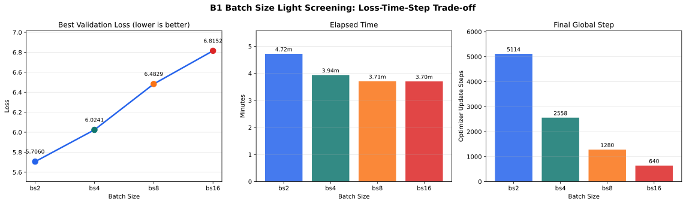
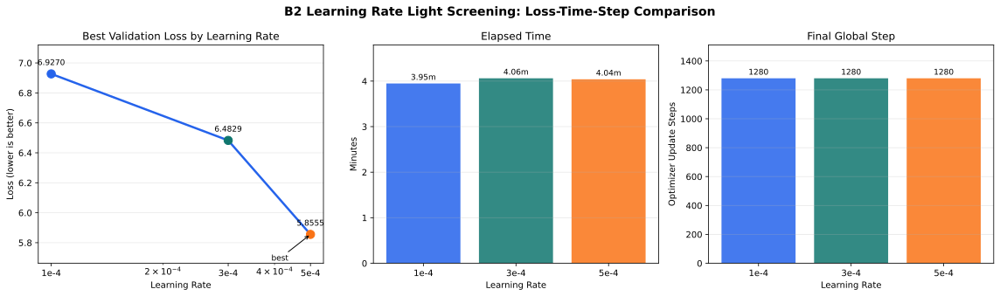

# B 실험 결과: 학습 하이퍼파라미터 탐색

| 항목 | 내용 |
| --- | --- |
| 담당자 | 영빈 |
| 담당 영역 | 하이퍼파라미터 탐색 1 |
| 주요 실험 | batch_size, learning_rate, drop_rate |
| 원본 계획 | [`EXPERIMENT_PLAN.md`](./EXPERIMENT_PLAN.md) |
| 실행 스크립트 | `experiments/scripts/run_b_hparams.py` |

## 1. 실험 목표

학습 설정이 사전 학습 성능과 학습 시간에 미치는 영향을 확인한다. 시간이 제한되어 있으므로 learning_rate 비교를 필수로 수행하고, batch_size와 drop_rate는 가능한 범위에서 진행한다.

핵심 질문은 다음과 같다.

- learning_rate 1e-4, 3e-4, 5e-4 중 어떤 값이 가장 안정적으로 수렴하는가?
- batch_size를 키웠을 때 학습 시간과 validation loss가 어떻게 달라지는가?
- drop_rate가 과적합 완화에 도움이 되는가?

## 2. 공통 환경

| 항목 | 값 |
| --- | --- |
| Colab GPU | T4 |
| Colab runtime | GPU, Latest |
| Python version | 3.12.13 |
| PyTorch version | 2.11.0+cu128 |
| CUDA version | 12.8 |
| git commit | `bab3567` |
| seed | 42 |
| 데이터 경로 | `/content/week14-team-05-gpt-lab/data/` |
| Google Drive output root | `/content/drive/MyDrive/gpt-lab/experiment_outputs/pretrain/{실험ID}_{YYYYMMDD}_YEONGBEEN/` |
| 공유 tokenizer 경로 | `artifacts/tokenizers/nsmc_bpe_vocab{vocab_size}_full.json` |
| raw metric JSONL 경로 | `{output_root}/metrics/{실험ID}_{YYYYMMDD}_metrics.jsonl` |
| stdout/stderr log 경로 | `{output_root}/logs/{실험ID}_{YYYYMMDD}.out` |
| latest checkpoint 경로 | `{output_root}/checkpoints/{실험ID}_{YYYYMMDD}_step{global_step}_latest.pt` |
| best checkpoint 경로 | `{output_root}/checkpoints/{실험ID}_{YYYYMMDD}_step{global_step}_best.pt` |

## 3. 고정 설정

| 항목 | 값 |
| --- | --- |
| context_length | 64 |
| n_layers | 2 |
| emb_dim | 128 |
| n_heads | 4 |
| optimizer | AdamW |
| num_epochs | 2~3 |
| log_every_steps | 20 |
| eval_every_steps | 100 |
| save_every_steps | 100 |
| keep_latest | 2 |

## 4. 실행 규모 기준

| 구분 | 모델 학습 입력 규모 | vocab_size | context_length | 용도 | 결과 반영 |
| --- | ---: | ---: | ---: | --- | --- |
| Smoke | `corpus[:5000]` 수준 | 300 | 32 | 실행 확인 | 공식 비교 제외 |
| Light | `corpus[:500000]` 수준 | 2000 | 64 | 1차 screening | 후보 선별 |
| Basic | `corpus[:1500000]` 수준 | 3000 | 128 | 제출 최소 기준 | 최종 후보 검증 |

위 고정 설정의 `context_length=64`는 1차 screening 기준이다. 1차 screening은 `--vocab-size 2000 --train-char-limit 500000`으로 실행하고, 최종 하이퍼파라미터 후보는 가능하면 Basic 기준인 `--vocab-size 3000 --train-char-limit 1500000`으로 재확인한다. Basic 재확인을 하지 못한 경우 그 이유를 결론에 적는다.

## 5. 실험 결과

### 5.1 Quick smoke 실행 확인

`--quick` 옵션으로 `B2_lr3e-4` 설정을 작은 입력 규모에서 실행해 스크립트, tokenizer 로드, metric JSONL, log, checkpoint 저장 경로가 정상 동작하는지 확인했다. 이 결과는 smoke test이므로 공식 하이퍼파라미터 비교에는 사용하지 않는다.

| 항목 | 값 |
| --- | --- |
| 실행 명령 | `run_b_hparams.py --experiment B2_lr3e-4 --quick` |
| experiment_id | `B2_lr3e-4` |
| 변경 변수 | learning_rate |
| 변경값 | 0.0003 |
| vocab_size | 300 |
| train_char_limit / val_char_limit | 5000 / 2000 |
| batch_size | 2 |
| context_length | 32 |
| n_layers / emb_dim | 1 / 64 |
| num_epochs | 1 |
| final_global_step | 137 |
| best val loss | 4.602464110762985 |
| elapsed_min | 0.04589358568191528 |
| tokenizer | `/content/drive/MyDrive/gpt-lab/experiment_outputs/pretrain/B2_lr3e-4_20260602_YEONGBEEN/tokenizers/nsmc_bpe_vocab300_full.json` |
| best checkpoint | `/content/drive/MyDrive/gpt-lab/experiment_outputs/pretrain/B2_lr3e-4_20260602_YEONGBEEN/checkpoints/B2_lr3e-4_20260602_step0137_best.pt` |
| metric JSONL | `/content/drive/MyDrive/gpt-lab/experiment_outputs/pretrain/B2_lr3e-4_20260602_YEONGBEEN/metrics/B2_lr3e-4_20260602_metrics.jsonl` |
| stdout/stderr log | `/content/drive/MyDrive/gpt-lab/experiment_outputs/pretrain/B2_lr3e-4_20260602_YEONGBEEN/logs/B2_lr3e-4_20260602.out` |
| 결과 | 정상 완료 |

실행 환경:

| 항목 | 값 |
| --- | --- |
| Python | 3.12.13 |
| PyTorch | 2.11.0+cu128 |
| CUDA | 12.8 |
| GPU | Tesla T4 |
| git commit | `bab3567` |

생성 샘플:

```text
영화��� � �설�. � 뼈! �!��읹�눰�� ���숌이�� �� �������
```

### 5.2 공식 비교 결과

| 실험 ID | 변경 변수 | 값 | best global_step | best val loss | final train loss | 소요 시간 | best checkpoint | metric JSONL | 결론 |
| --- | --- | --- | --- | --- | --- | --- | --- | --- | --- |
| B1_bs2 | batch_size | 2 | 5100 | 5.705958318710327 | 6.0562 | 4.722735257943471 min | `/content/drive/MyDrive/gpt-lab/experiment_outputs/pretrain/B1_bs2_20260602_YEONGBEEN/checkpoints/B1_bs2_20260602_step5100_best.pt` | `/content/drive/MyDrive/gpt-lab/experiment_outputs/pretrain/B1_bs2_20260602_YEONGBEEN/metrics/B1_bs2_20260602_metrics.jsonl` | B1 중 best val loss가 가장 낮음 |
| B1_bs4 | batch_size | 4 | 2558 | 6.024056546390057 | 6.4372 | 3.9405784408251443 min | `/content/drive/MyDrive/gpt-lab/experiment_outputs/pretrain/B1_bs4_20260602_YEONGBEEN/checkpoints/B1_bs4_20260602_step2558_best.pt` | `/content/drive/MyDrive/gpt-lab/experiment_outputs/pretrain/B1_bs4_20260602_YEONGBEEN/metrics/B1_bs4_20260602_metrics.jsonl` | bs2보다 빠르지만 현재 기준 val loss는 더 높음 |
| B1_bs8 | batch_size | 8 | 1280 | 6.482938192784786 | 6.7623 | 3.7096256772677103 min | `/content/drive/MyDrive/gpt-lab/experiment_outputs/pretrain/B1_bs8_20260602_YEONGBEEN/checkpoints/B1_bs8_20260602_step1280_best.pt` | `/content/drive/MyDrive/gpt-lab/experiment_outputs/pretrain/B1_bs8_20260602_YEONGBEEN/metrics/B1_bs8_20260602_metrics.jsonl` | bs4보다 약간 빠르지만 val loss는 더 높음 |
| B1_bs16 | batch_size | 16 | 640 | 6.815157011151314 | 6.9020 | 3.703726518154144 min | `/content/drive/MyDrive/gpt-lab/experiment_outputs/pretrain/B1_bs16_20260602_YEONGBEEN/checkpoints/B1_bs16_20260602_step0640_best.pt` | `/content/drive/MyDrive/gpt-lab/experiment_outputs/pretrain/B1_bs16_20260602_YEONGBEEN/metrics/B1_bs16_20260602_metrics.jsonl` | 가장 빠른 편이지만 B1 중 val loss가 가장 높음 |
| B2_lr1e-4 | learning_rate | 1e-4 | 1280 | 6.926981143653393 | 6.9377 | 3.947630472977956 min | `/content/drive/MyDrive/gpt-lab/experiment_outputs/pretrain/B2_lr1e-4_20260603_YEONGBEEN/checkpoints/B2_lr1e-4_20260603_step1280_best.pt` | `/content/drive/MyDrive/gpt-lab/experiment_outputs/pretrain/B2_lr1e-4_20260603_YEONGBEEN/metrics/B2_lr1e-4_20260603_metrics.jsonl` | B2 중 best val loss가 가장 높음 |
| B2_lr3e-4 | learning_rate | 3e-4 | 1280 | 6.482938192784786 | 6.7623 | 4.061138451099396 min | `/content/drive/MyDrive/gpt-lab/experiment_outputs/pretrain/B2_lr3e-4_20260603_YEONGBEEN/checkpoints/B2_lr3e-4_20260603_step1280_best.pt` | `/content/drive/MyDrive/gpt-lab/experiment_outputs/pretrain/B2_lr3e-4_20260603_YEONGBEEN/metrics/B2_lr3e-4_20260603_metrics.jsonl` | lr1e-4보다 val loss가 낮음 |
| B2_lr5e-4 | learning_rate | 5e-4 | 1280 | 5.855498008430004 | 6.2834 | 4.039404197533925 min | `/content/drive/MyDrive/gpt-lab/experiment_outputs/pretrain/B2_lr5e-4_20260603_YEONGBEEN/checkpoints/B2_lr5e-4_20260603_step1280_best.pt` | `/content/drive/MyDrive/gpt-lab/experiment_outputs/pretrain/B2_lr5e-4_20260603_YEONGBEEN/metrics/B2_lr5e-4_20260603_metrics.jsonl` | B2 중 best val loss가 가장 낮음 |
| B3 | drop_rate | 0.0 |  |  |  |  |  |  |  |
| B3 | drop_rate | 0.1 |  |  |  |  |  |  |  |
| B3 | drop_rate | 0.2 |  |  |  |  |  |  |  |

### 5.3 B1 Batch Size 비교 분석

#### 5.3.1 비교 시각화



#### 5.3.2 결론 및 해석

B1 batch_size 비교에서는 `batch_size=2`가 가장 낮은 validation loss를 보였다. `batch_size=2`는 best validation loss가 5.705958318710327로 가장 낮아 성능 기준으로 가장 좋은 후보였다. 반면 소요 시간은 4.722735257943471분으로 가장 길었고, final global step도 5114로 가장 많았다.

`batch_size`가 4, 8, 16으로 커질수록 실행 시간은 3.9405784408251443분, 3.7096256772677103분, 3.703726518154144분으로 줄었지만, best validation loss는 6.024056546390057, 6.482938192784786, 6.815157011151314로 점점 나빠졌다. 특히 final global step이 2558, 1280, 640으로 감소하므로, 이 결과는 큰 batch size 자체의 성능 저하라기보다 같은 epoch 수에서 optimizer update 기회가 줄어든 영향까지 포함한 비교로 해석해야 한다.

따라서 Light screening 기준 성능 우선 후보는 `batch_size=2`이고, 시간 효율까지 고려한 보조 후보는 `batch_size=4`다. 최종 선택은 Basic 기준에서 `batch_size=2`를 재확인하거나, 같은 update step 수를 맞춘 추가 비교를 통해 보완하는 것이 좋다.

### 5.4 B2 Learning Rate 비교 분석

#### 5.4.1 비교 시각화



#### 5.4.2 결론 및 해석

B2 learning_rate 비교에서는 learning_rate를 1e-4, 3e-4, 5e-4로 높일수록 best validation loss가 6.926981143653393, 6.482938192784786, 5.855498008430004 순서로 낮아졌다. 현재 Light screening 범위에서는 `learning_rate=5e-4`가 가장 좋은 후보이며, 발산 징후 없이 2 epoch 동안 loss가 계속 감소했다.

세 실험 모두 `batch_size=8`, `context_length=64`, `num_epochs=2`, `final_global_step=1280`으로 동일하므로, B1 batch size 비교보다 learning_rate 자체의 영향을 더 직접적으로 볼 수 있다. 실행 시간도 3.947630472977956분, 4.061138451099396분, 4.039404197533925분으로 거의 비슷해 시간 차이가 결론에 큰 영향을 주지 않는다.

다만 이번 탐색 범위 안에서는 loss가 계속 감소했기 때문에, 최적점이 아직 5e-4보다 높은 구간에 있을 가능성도 남아 있다. 최종 후보를 확정하려면 Basic 기준에서 5e-4를 재확인하거나, 시간이 허용되면 7e-4 또는 1e-3 같은 추가 learning_rate를 짧게 검증하는 것이 좋다.

### 5.5 세부 기록

#### 5.5.1 B1 세부 기록

##### B1_bs2

| 항목 | 값 |
| --- | --- |
| 실행 규모 | Light screening |
| experiment_id | `B1_bs2` |
| 변경 변수 | batch_size |
| 변경값 | 2 |
| vocab_size | 2000 |
| tokenizer | `artifacts/tokenizers/nsmc_bpe_vocab2000_full.json` |
| train_char_limit / val_char_limit | 500000 / 50000 |
| context_length | 64 |
| n_layers / emb_dim / n_heads | 2 / 128 / 4 |
| learning_rate | 0.0003 |
| drop_rate | 0.1 |
| num_epochs | 2 |
| final_global_step | 5114 |
| elapsed_min | 4.722735257943471 |
| best checkpoint | `/content/drive/MyDrive/gpt-lab/experiment_outputs/pretrain/B1_bs2_20260602_YEONGBEEN/checkpoints/B1_bs2_20260602_step5100_best.pt` |
| latest checkpoints | `/content/drive/MyDrive/gpt-lab/experiment_outputs/pretrain/B1_bs2_20260602_YEONGBEEN/checkpoints/B1_bs2_20260602_step5000_latest.pt`, `/content/drive/MyDrive/gpt-lab/experiment_outputs/pretrain/B1_bs2_20260602_YEONGBEEN/checkpoints/B1_bs2_20260602_step5100_latest.pt` |
| stdout/stderr log | `/content/drive/MyDrive/gpt-lab/experiment_outputs/pretrain/B1_bs2_20260602_YEONGBEEN/logs/B1_bs2_20260602.out` |

Epoch별 결과:

| epoch | train loss | val loss | best val loss |
| ---: | ---: | ---: | ---: |
| 1 | 6.8774 | 6.4467 | 6.4467 |
| 2 | 6.0562 | 5.7278 | 5.705958318710327 |

생성 샘플:

```text
영화.. 이건 이런 드라마가 아깝다
아도 그저씨, 이런거지마라가 가능하는 장면에 미소를 주어나온다. 스토리도 안되는 장면을 생각나가 좋아도 이럴고 보길심
```

##### B1_bs4

| 항목 | 값 |
| --- | --- |
| 실행 규모 | Light screening |
| experiment_id | `B1_bs4` |
| 변경 변수 | batch_size |
| 변경값 | 4 |
| vocab_size | 2000 |
| tokenizer | `artifacts/tokenizers/nsmc_bpe_vocab2000_full.json` |
| train_char_limit / val_char_limit | 500000 / 50000 |
| context_length | 64 |
| n_layers / emb_dim / n_heads | 2 / 128 / 4 |
| learning_rate | 0.0003 |
| drop_rate | 0.1 |
| num_epochs | 2 |
| final_global_step | 2558 |
| best checkpoint | `/content/drive/MyDrive/gpt-lab/experiment_outputs/pretrain/B1_bs4_20260602_YEONGBEEN/checkpoints/B1_bs4_20260602_step2558_best.pt` |
| latest checkpoints | `/content/drive/MyDrive/gpt-lab/experiment_outputs/pretrain/B1_bs4_20260602_YEONGBEEN/checkpoints/B1_bs4_20260602_step2400_latest.pt`, `/content/drive/MyDrive/gpt-lab/experiment_outputs/pretrain/B1_bs4_20260602_YEONGBEEN/checkpoints/B1_bs4_20260602_step2500_latest.pt` |
| stdout/stderr log | `/content/drive/MyDrive/gpt-lab/experiment_outputs/pretrain/B1_bs4_20260602_YEONGBEEN/logs/B1_bs4_20260602.out` |

Epoch별 결과:

| epoch | train loss | val loss | best val loss |
| ---: | ---: | ---: | ---: |
| 1 | 6.9730 | 6.7991 | 6.7991 |
| 2 | 6.4372 | 6.0241 | 6.024056546390057 |

생성 샘플:

```text
영화도 맫�스도 아닌게 봤습니다..
정말아까 bompesodF도 볼수를 볼고 다큐....
너무재밌작? 아....oeaT��는 왜 자아까
```

##### B1_bs8

| 항목 | 값 |
| --- | --- |
| 실행 규모 | Light screening |
| experiment_id | `B1_bs8` |
| 변경 변수 | batch_size |
| 변경값 | 8 |
| vocab_size | 2000 |
| tokenizer | `artifacts/tokenizers/nsmc_bpe_vocab2000_full.json` |
| train_char_limit / val_char_limit | 500000 / 50000 |
| context_length | 64 |
| n_layers / emb_dim / n_heads | 2 / 128 / 4 |
| learning_rate | 0.0003 |
| drop_rate | 0.1 |
| num_epochs | 2 |
| final_global_step | 1280 |
| best checkpoint | `/content/drive/MyDrive/gpt-lab/experiment_outputs/pretrain/B1_bs8_20260602_YEONGBEEN/checkpoints/B1_bs8_20260602_step1280_best.pt` |
| latest checkpoints | `/content/drive/MyDrive/gpt-lab/experiment_outputs/pretrain/B1_bs8_20260602_YEONGBEEN/checkpoints/B1_bs8_20260602_step1100_latest.pt`, `/content/drive/MyDrive/gpt-lab/experiment_outputs/pretrain/B1_bs8_20260602_YEONGBEEN/checkpoints/B1_bs8_20260602_step1200_latest.pt` |
| stdout/stderr log | `/content/drive/MyDrive/gpt-lab/experiment_outputs/pretrain/B1_bs8_20260602_YEONGBEEN/logs/B1_bs8_20260602.out` |

Epoch별 결과:

| epoch | train loss | val loss | best val loss |
| ---: | ---: | ---: | ---: |
| 1 | 7.0121 | 6.9196 | 6.9196 |
| 2 | 6.7623 | 6.4829 | 6.482938192784786 |

생성 샘플:

```text
영화는 �고 보이 B�게 안하고영화 영화한 시.영화로,
0분에 취한
세의 찌다 그�이 아을 보여스h�니
별........ 
```

##### B1_bs16

| 항목 | 값 |
| --- | --- |
| 실행 규모 | Light screening |
| experiment_id | `B1_bs16` |
| 변경 변수 | batch_size |
| 변경값 | 16 |
| vocab_size | 2000 |
| tokenizer | `artifacts/tokenizers/nsmc_bpe_vocab2000_full.json` |
| train_char_limit / val_char_limit | 500000 / 50000 |
| context_length | 64 |
| n_layers / emb_dim / n_heads | 2 / 128 / 4 |
| learning_rate | 0.0003 |
| drop_rate | 0.1 |
| num_epochs | 2 |
| final_global_step | 640 |
| best checkpoint | `/content/drive/MyDrive/gpt-lab/experiment_outputs/pretrain/B1_bs16_20260602_YEONGBEEN/checkpoints/B1_bs16_20260602_step0640_best.pt` |
| latest checkpoints | `/content/drive/MyDrive/gpt-lab/experiment_outputs/pretrain/B1_bs16_20260602_YEONGBEEN/checkpoints/B1_bs16_20260602_step0500_latest.pt`, `/content/drive/MyDrive/gpt-lab/experiment_outputs/pretrain/B1_bs16_20260602_YEONGBEEN/checkpoints/B1_bs16_20260602_step0600_latest.pt` |
| stdout/stderr log | `/content/drive/MyDrive/gpt-lab/experiment_outputs/pretrain/B1_bs16_20260602_YEONGBEEN/logs/B1_bs16_20260602.out` |

Epoch별 결과:

| epoch | train loss | val loss | best val loss |
| ---: | ---: | ---: | ---: |
| 1 | 7.0544 | 6.9313 | 6.9313 |
| 2 | 6.9020 | 6.8152 | 6.815157011151314 |

생성 샘플:

```text
영화에가장다�아�한. 그 그�도리아지만 이하고지는
만나어은�은로다.
아어다이진의다.이 이점�나..하이 ...어...하
```

#### 5.5.2 B2 세부 기록

##### B2_lr1e-4

| 항목 | 값 |
| --- | --- |
| 실행 규모 | Light screening |
| experiment_id | `B2_lr1e-4` |
| 변경 변수 | learning_rate |
| 변경값 | 0.0001 |
| vocab_size | 2000 |
| tokenizer | `/content/week14-team-05-gpt-lab/artifacts/tokenizers/nsmc_bpe_vocab2000_full.json` |
| train_char_limit / val_char_limit | 500000 / 50000 |
| context_length | 64 |
| batch_size | 8 |
| n_layers / emb_dim / n_heads | 2 / 128 / 4 |
| drop_rate | 0.1 |
| num_epochs | 2 |
| final_global_step | 1280 |
| elapsed_min | 3.947630472977956 |
| best checkpoint | `/content/drive/MyDrive/gpt-lab/experiment_outputs/pretrain/B2_lr1e-4_20260603_YEONGBEEN/checkpoints/B2_lr1e-4_20260603_step1280_best.pt` |
| latest checkpoints | `/content/drive/MyDrive/gpt-lab/experiment_outputs/pretrain/B2_lr1e-4_20260603_YEONGBEEN/checkpoints/B2_lr1e-4_20260603_step1100_latest.pt`, `/content/drive/MyDrive/gpt-lab/experiment_outputs/pretrain/B2_lr1e-4_20260603_YEONGBEEN/checkpoints/B2_lr1e-4_20260603_step1200_latest.pt` |
| stdout/stderr log | `/content/drive/MyDrive/gpt-lab/experiment_outputs/pretrain/B2_lr1e-4_20260603_YEONGBEEN/logs/B2_lr1e-4_20260603.out` |

Epoch별 결과:

| epoch | train loss | val loss | best val loss |
| ---: | ---: | ---: | ---: |
| 1 | 7.1283 | 6.9345 | 6.9345 |
| 2 | 6.9377 | 6.9270 | 6.926981143653393 |

생성 샘플:

```text
영화는가는서.로.

에.리이 영화이을.다로지
도
 영화로은한
을의다.,이니지이니가.. 영화을도에
고....라이한
```

##### B2_lr3e-4

| 항목 | 값 |
| --- | --- |
| 실행 규모 | Light screening |
| experiment_id | `B2_lr3e-4` |
| 변경 변수 | learning_rate |
| 변경값 | 0.0003 |
| vocab_size | 2000 |
| tokenizer | `/content/week14-team-05-gpt-lab/artifacts/tokenizers/nsmc_bpe_vocab2000_full.json` |
| train_char_limit / val_char_limit | 500000 / 50000 |
| context_length | 64 |
| batch_size | 8 |
| n_layers / emb_dim / n_heads | 2 / 128 / 4 |
| drop_rate | 0.1 |
| num_epochs | 2 |
| final_global_step | 1280 |
| elapsed_min | 4.061138451099396 |
| best checkpoint | `/content/drive/MyDrive/gpt-lab/experiment_outputs/pretrain/B2_lr3e-4_20260603_YEONGBEEN/checkpoints/B2_lr3e-4_20260603_step1280_best.pt` |
| latest checkpoints | `/content/drive/MyDrive/gpt-lab/experiment_outputs/pretrain/B2_lr3e-4_20260603_YEONGBEEN/checkpoints/B2_lr3e-4_20260603_step1100_latest.pt`, `/content/drive/MyDrive/gpt-lab/experiment_outputs/pretrain/B2_lr3e-4_20260603_YEONGBEEN/checkpoints/B2_lr3e-4_20260603_step1200_latest.pt` |
| stdout/stderr log | `/content/drive/MyDrive/gpt-lab/experiment_outputs/pretrain/B2_lr3e-4_20260603_YEONGBEEN/logs/B2_lr3e-4_20260603.out` |

Epoch별 결과:

| epoch | train loss | val loss | best val loss |
| ---: | ---: | ---: | ---: |
| 1 | 7.0121 | 6.9196 | 6.9196 |
| 2 | 6.7623 | 6.4829 | 6.482938192784786 |

생성 샘플:

```text
영화는 �고 보이 B�게 안하고영화 영화한 시.영화로,
0분에 취한
세의 찌다 그�이 아을 보여스h�니
별........ 
```

##### B2_lr5e-4

| 항목 | 값 |
| --- | --- |
| 실행 규모 | Light screening |
| experiment_id | `B2_lr5e-4` |
| 변경 변수 | learning_rate |
| 변경값 | 0.0005 |
| vocab_size | 2000 |
| tokenizer | `/content/week14-team-05-gpt-lab/artifacts/tokenizers/nsmc_bpe_vocab2000_full.json` |
| train_char_limit / val_char_limit | 500000 / 50000 |
| context_length | 64 |
| batch_size | 8 |
| n_layers / emb_dim / n_heads | 2 / 128 / 4 |
| drop_rate | 0.1 |
| num_epochs | 2 |
| final_global_step | 1280 |
| elapsed_min | 4.039404197533925 |
| best checkpoint | `/content/drive/MyDrive/gpt-lab/experiment_outputs/pretrain/B2_lr5e-4_20260603_YEONGBEEN/checkpoints/B2_lr5e-4_20260603_step1280_best.pt` |
| latest checkpoints | `/content/drive/MyDrive/gpt-lab/experiment_outputs/pretrain/B2_lr5e-4_20260603_YEONGBEEN/checkpoints/B2_lr5e-4_20260603_step1100_latest.pt`, `/content/drive/MyDrive/gpt-lab/experiment_outputs/pretrain/B2_lr5e-4_20260603_YEONGBEEN/checkpoints/B2_lr5e-4_20260603_step1200_latest.pt` |
| stdout/stderr log | `/content/drive/MyDrive/gpt-lab/experiment_outputs/pretrain/B2_lr5e-4_20260603_YEONGBEEN/logs/B2_lr5e-4_20260603.out` |

Epoch별 결과:

| epoch | train loss | val loss | best val loss |
| ---: | ---: | ---: | ---: |
| 1 | 6.9625 | 6.7253 | 6.7253 |
| 2 | 6.2834 | 5.8555 | 5.855498008430004 |

생성 샘플:

```text
영화.
평점만 잘가 좀 BSaeeneeoihee tehemmops ㅜㅜhghtveeve정말 dosevit
```

## 6. Best 후보

| 항목 | 선택값 | 선택 이유 | 기준 metric |
| --- | --- | --- | --- |
| best batch_size | 2 | Light screening에서 B1 후보 중 best val loss가 가장 낮음. 소요 시간은 bs4/bs8/bs16보다 길어 Basic 기준 재확인 필요 | best_val_loss 5.705958318710327 |
| best learning_rate | 5e-4 | Light screening에서 B2 후보 중 best val loss가 가장 낮음. 발산 징후 없이 loss가 감소했으나 Basic 기준 재확인 필요 | best_val_loss 5.855498008430004 |
| best drop_rate |  |  |  |

## 7. 실패 또는 중단 실험

| 실험 ID | 원인 | 조치 | 보존 로그 |
| --- | --- | --- | --- |
|  |  |  |  |

## 8. 최종 결론

```text
가장 좋은 learning_rate, batch_size, drop_rate 후보와
그 선택 근거를 validation loss, 안정성, 소요 시간 기준으로 적는다.
```
