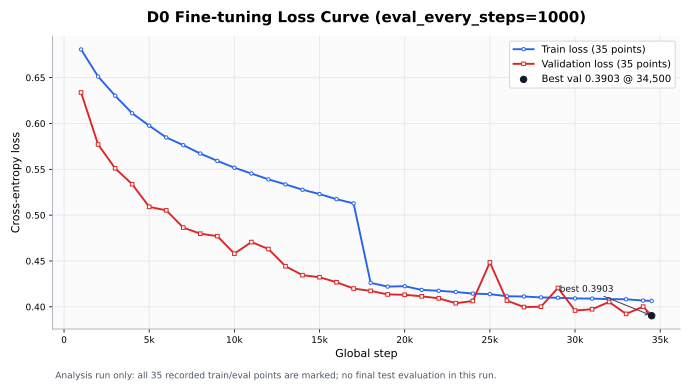

# 미니 GPT 발표용 요약 보고서

## 팀 정보

| 항목 | 내용 |
| --- | --- |
| 반 | 303호 |
| 팀명 | 5팀 |
| 팀원 | 최영빈, 조범상, 임재환, 윤형민 |

## 프로젝트 목적

이 프로젝트의 목표는 PyTorch만 사용해 미니 GPT의 핵심 구성 요소를 직접 구현하고, NSMC 영화 리뷰 데이터로 사전 학습과 감성 분류 미세 조정 흐름을 검증하는 것입니다. 저희 팀은 실험의 기준선을 정하고, 안정화 기법과 하이퍼파라미터 변경이 검증 지표(validation loss)에 어떤 영향을 주는지 비교하는 방식으로 실험을 진행했습니다.

## 1. 핵심 요약

| 항목 | 결과 |
| --- | --- |
| 구현 범위 | BPE 토크나이저, 데이터셋/데이터 로더, 입력 임베딩, 인과적 자기 어텐션, GPT 모델, 사전 학습 루프, 감성 분류 미세 조정 |
| 전체 테스트 | 과제 기본 테스트 28개 통과 |
| 선택한 사전 학습 기준선 | A0_basic |
| 사전 학습 최저 검증 손실 | 6.7148 |
| 선택한 감성 분류 기준선 | D0 |
| 최종 감성 분류 테스트 정확도 | 0.8188 |

이번 실험에서는 Basic 기준의 `A0_basic`이 비교한 다른 설정들보다 낮은 검증 손실을 보여, 차후 실험을 위한 1차 사전 학습 체크포인트로 지정했습니다. 감성 분류에서는 D0 기준선을 최종 테스트 평가 대상으로 선택했습니다.

## 2. 구현 현황

| 단계 | 구현 내용 | 파일 |
| --- | --- | --- |
| 1 | UTF-8 바이트 단위 BPE 토크나이저 | `src/bpe.py` |
| 2 | GPT 데이터셋, 데이터 로더, 입력 임베딩 | `src/dataset.py`, `src/embeddings.py` |
| 3 | 인과적 다중 헤드 자기 어텐션 | `src/attention.py` |
| 4 | LayerNorm, GELU, FFN, TransformerBlock, GPTModel | `src/model.py` |
| 5 | 손실 계산, 생성, 체크포인트, 사전 학습 루프 | `src/train.py` |
| 6 | NSMC 감성 분류 데이터셋, 분류기, 미세 조정 | `src/finetune.py` |

과제 기본 구현 테스트 28개를 모두 통과했습니다.

### 모델 사용 흐름

사전 학습에서는 GPT 본체 뒤의 LM head로 다음 token을 예측했습니다.

```text
token embedding + position embedding
→ Transformer blocks
→ final LayerNorm
→ LM head
→ 다음 token 예측
```

감성 분류 fine-tuning에서는 LM head를 사용하지 않고, GPT hidden state 위에 별도 classifier를 붙였습니다.

```text
token embedding + position embedding
→ Transformer blocks
→ final LayerNorm
→ 마지막 non-padding token hidden state
→ classifier
→ 부정/긍정 예측
```

## 3. 데이터와 공통 설정

| 항목 | 내용 |
| --- | --- |
| 데이터 | NAVER Sentiment Movie Corpus(NSMC) |
| 사전 학습 데이터 | `data/nsmc_lm_train.txt`, `data/nsmc_lm_val.txt` |
| 감성 분류 데이터 | 학습/검증/테스트 JSONL |
| 라벨 균형 | 학습 0.4994, 검증 0.4921, 테스트 0.5035 긍정 비율 |
| 토크나이저 | UTF-8 바이트 단위 BPE |
| 공유 어휘 파일 | `artifacts/tokenizers/nsmc_bpe_vocab3000_full.json` |
| 특수 토큰 | `<pad>=0`, `<unk>=1`, `<bos>=2`, `<eos>=3` |


라벨 비율은 학습/검증/테스트 모두 거의 50:50이었습니다. 따라서 D 감성 분류 실험에서는 클래스 가중치나 샘플링 기반 불균형 보정을 적용하지 않았습니다.

### 리뷰 길이 분포 확인

D fine-tuning에서는 공유 BPE tokenizer(`artifacts/tokenizers/nsmc_bpe_vocab3000_full.json`) 기준으로 리뷰 길이 분포를 확인했습니다. fine-tuning에 실제 사용한 훈련/검증/테스트 샘플 총 199,992개에서 token 길이 중앙값은 15~16 token이고, 95% 지점은 63~64 token 수준이었습니다.

| 기준 | 커버되는 리뷰 수 | 초과 리뷰 수 | coverage | 해석 |
| --- | ---: | ---: | ---: | --- |
| `max_length=64` | 190,536 | 9,456 | 약 95.27% | 빠른 screening에는 충분하지만 약 4.73%의 리뷰가 잘릴 수 있음 |
| `max_length=128` | 199,971 | 21 | 약 99.99% | 거의 모든 리뷰를 보존하므로 최종 D fine-tuning 기준으로 타당함 |

최종 감성 분류 평가에서는 입력 문장이 모델의 최대 길이보다 길어서 뒤쪽 일부가 잘릴 때 생기는 문제를 거의 없애기 위해 `max_length=128`을 사용했습니다.


Basic 기준으로 제출용 최소 검증 규모 
`vocab_size=3000`, `context_length=128`, `train_char_limit=1500000`, `num_epochs=2`

아래 Basic 설정은 저희 팀이 기준선으로 정한 `A0_basic`의 사전 학습 실험에 사용한 모델 및 학습 파라미터입니다.

| 항목 | Basic 설정 |
| --- | ---: |
| vocab_size | 3000 |
| context_length | 128 |
| emb_dim | 128 |
| n_heads | 4 |
| n_layers | 2 |
| drop_rate | 0.1 |
| qkv_bias | False |
| 파라미터 수 | 1,180,160 |
| 최적화 방식 | AdamW |
| learning_rate | 3e-4 |
| batch_size | 8 |

## 4. A 실험: 사전 학습 안정화

과제 추가 미션 7.1에서는 사전 학습 성능 향상을 위해 `warmup`, `cosine decay`, `gradient clipping`, `weight decay` 실험을 제안했습니다. 
A 실험에서는 Basic 기준선에 이 안정화 기법들을 추가했을 때 검증 손실이 개선되는지 비교했습니다.

| 안정화 기법 | 의미 |
| --- | --- |
| `warmup` | 학습 초반 `learning_rate`를 점진적으로 올리는 방법 |
| `cosine decay` | 학습이 진행될수록 `learning_rate`를 서서히 낮추는 방법 |
| `gradient clipping` | gradient가 과도하게 커지는 것을 제한하는 방법 |
| `weight decay` | 가중치가 과도하게 커지는 것을 억제하는 정규화 방법 |

| 실험 ID | 변경점 | 최저 검증 손실 | 기준선 대비 | 결론 |
| --- | --- | ---: | ---: | --- |
| A0_basic | Basic 기준선 | 6.7148 | 0.0000 | 1차 사전 학습 후보 |
| A1 | warmup + cosine decay | 7.2470 | +0.5322 | 제외 |
| A2 | gradient clipping | 6.7264 | +0.0116 | 제외 |
| A3 | `weight_decay=0.01` | 6.7262 | +0.0114 | 제외 |
| A4 | warmup + cosine decay + clipping + weight decay | 7.2467 | +0.5319 | 제외 |


현재 2 epoch Basic 조건에서는 안정화 기법을 추가한 후보들이 기준선보다 낮은 검증 손실을 만들지 못했습니다. 따라서 후속 감성 분류에는 `A0_basic`에서 검증 손실이 가장 낮았던 체크포인트를 사용했습니다.

## 5. B 실험: 학습 하이퍼파라미터

B 실험에서는 배치 크기, 학습률, 드롭아웃을 바꾸어 다음 Basic 확인에 사용할 후보 설정을 좁혔습니다.

| 실험 ID | 변경 변수 | 후보 | 선택값 | 근거 |
| --- | --- | --- | --- | --- |
| B1 | `batch_size` | 2, 4, 8, 16 | 2 | Light 후보 선별에서 최저 검증 손실 5.7060 |
| B2 | `learning_rate` | 1e-4, 3e-4, 5e-4 | 5e-4 | 동일한 `global_step` 조건에서 최저 검증 손실 5.8555 |
| B3 | `drop_rate` | 0.0, 0.1, 0.2 | 0.0 | 드롭아웃 증가 시 검증 손실 증가 |


B 실험은 `vocab_size=2000`, `context_length=64`, `train_char_limit=500000` 설정의 Light 후보 선별로 진행했습니다. 배치 크기 비교는 작은 배치일수록 같은 epoch에서 업데이트 횟수가 많아지는 영향이 있어, 후속 Basic 기준으로 재확인이 필요합니다.

## 6. C 실험: 모델 구조 탐색

C 실험에서는 문맥 길이, 레이어 수, 임베딩 차원을 바꾸어 모델 구조 후보를 비교했습니다.

| 실험 ID | 변경 변수 | 후보 | 선택값 | 근거 |
| --- | --- | --- | --- | --- |
| C1 | `context_length` | 64, 128 | 64 | 500k 후보 선별에서 64가 더 낮은 검증 손실 |
| C2 | `n_layers` | 1, 2, 4 | 4 | 4 layer에서 최저 검증 손실 7.1540 |
| C3 | `emb_dim` | 64, 128, 192 | 192 | `emb_dim=192`에서 최저 검증 손실 6.8935 |


C 결과는 구조 후보 선별로 해석했습니다. 세 선택값을 동시에 조합한 실험은 아니며, 차후 Basic 기준으로 재확인이 필요합니다.

## 7. D 실험: 감성 분류 미세 조정

D 실험에서는 `A0_basic` 체크포인트를 감성 분류에 미세 조정하고, GPT 첫 번째 층을 고정하거나 학습률을 분리하는 것이 기준선 대비 검증 지표를 개선하는지 비교했습니다.

| 실험 ID | 변경점 | 학습 손실 | 학습 정확도 | 최저 검증 손실 | 검증 정확도 | 결론 |
| --- | --- | ---: | ---: | ---: | ---: | --- |
| D0 | 감성 분류 기준선(전체 모델 학습, lr = 3e-4) | 0.4049 | 0.8151 | 0.3930 | 0.8186 | 최종 선택 |
| D2 | embedding + 앞쪽 Transformer block 1개 고정(lr = 3e-4) | 0.5697 | 0.6964 | 0.5469 | 0.7088 | 제외 |
| D3 | 분류기 (lr = 3e-4), GPT 본체 (lr = 1e-4) 분리 | 0.4589 | 0.7820 | 0.4342 | 0.7931 | 제외 |

의도는 이렇습니다.
- GPT 본체는 이미 사전 학습되어 있으므로 천천히 수정한다.
- 분류기는 새로 붙인 층이므로 더 빠르게 학습시킨다.
즉, D3는 "기존 지식은 조심스럽게 바꾸고, 새 분류기는 적극적으로 학습한다"는 전략입니다.

하지만 결과는 D0보다 좋지 않았습니다.


최종 test set은 후보 선택이 끝난 뒤 D0 checkpoint에 대해 한 번만 평가했습니다.

| 평가 | 대상 checkpoint | test loss | test accuracy |
| --- | --- | ---: | ---: |
| D4 | D0 selected checkpoint | 0.3939 | 0.8188 |

추가로 D0 기준선을 `eval_every_steps=1000`으로 재실행해 학습 곡선을 확인했습니다. 
이것은 손실 변화를 시각적으로 확인하기 위해 보조 분석으로 진행하였으며, test set은 평가하지 않았습니다.



D0의 train loss와 validation loss는 초반에 빠르게 감소했고, 후반에는 validation loss가 0.39~0.40 근처에서 완만하게 수렴했습니다. 보조 재실험의 최저 validation loss는 34,500 step의 0.3903이었으며, 최종 test 결과 해석은 기존 D4의 1회 test 평가를 기준으로 유지했습니다.

최종 테스트 정확도는 D0 체크포인트 기준 0.8188입니다. 보조 지표인 교차 엔트로피 손실은 0.3939입니다.

## 8. 최종 결론

| 구분 | 최종 선택 | 이유 |
| --- | --- | --- |
| 사전 학습 선택 실험 | A0_basic | Basic 기준 최저 검증 손실 6.7148 |
| 감성 분류 선택 실험 | D0 | D 후보 중 검증 손실은 가장 낮고 검증 정확도는 가장 높음 |
| 최종 테스트 정확도 | 0.8188 | 선택된 체크포인트에 대해 테스트 1회 평가 |

핵심 결론은 다음과 같습니다.

1. 이번 프로젝트에서는 mini GPT 구현 자체뿐 아니라, 사전 학습 checkpoint를 감성 분류 fine-tuning으로 이어 붙이는 전체 실험 흐름을 검증했습니다.
2. 제한된 Basic 조건에서는 복잡한 안정화 기법이나 fine-tuning 조정보다 단순한 기준선 조합인 `A0_basic + D0`가 가장 안정적인 결과를 보였습니다.
3. 따라서 이번 결과는 최고 성능 모델을 확정했다기보다, 재현 가능한 기준선과 후속 실험의 출발점을 확보했다는 의미가 큽니다.

## 9. 한계와 후속 과제

이번 결과는 제출 규모에서 mini GPT 구현과 fine-tuning 흐름을 검증한 결과입니다. 다만 최고 성능 탐색이 완료된 것은 아니며, B/C의 유망 후보는 Light screening 조건에서 나온 결과이므로 Basic 이상 규모에서 다시 확인해야 합니다. 또한 제한된 2 epoch 조건에서는 안정화 기법이 기준선보다 좋아지지 않았지만, 더 긴 학습에서는 다른 양상이 나올 수 있습니다.

| 우선순위 | 실험 |
| --- | --- |
| 1 | `A0_basic`을 3 epoch 이상으로 연장 |
| 2 | `learning_rate=5e-4`, `drop_rate=0.0`을 Basic 기준에서 재확인 |
| 3 | `n_layers=4`, `emb_dim=192` 구조를 조합해 Basic 규모에서 확인 |
| 4 | 새 사전 학습 체크포인트로 D 미세 조정을 다시 실행해 테스트 정확도 비교 |

## 10. 팀 활동 정리

이번 프로젝트는 A/B/C/D 역할을 나누어 진행했습니다. 
A는 사전 학습 안정화 기법, B는 학습 하이퍼파라미터, C는 모델 구조, D는 감성 분류 fine-tuning을 맡아 병렬로 테스트를 진행하였습니다.
실험 과정에서는 Light screening과 Basic 검증을 구분해 해석했고, metrics JSONL, checkpoint, 실험 보고서를 분리해 산출물을 관리했습니다. 
감성분류에 대한 실험을 한 D 실험에서 Colab 환경이 불안정하여 로컬 GPU에서 재현해 최종 결과를 정리했습니다.


## 참고

| 문서 | 용도 |
| --- | --- |
| `REPORT.md` | 전체 제출 보고서 |
| `docs/EXPERIMENT_A_JAEHWAN.md` | A 사전 학습 안정화 실험 |
| `docs/EXPERIMENT_B_YEONGBEEN.md` | B 하이퍼파라미터 실험 |
| `docs/EXPERIMENT_C_BEOMSANG.md` | C 구조 탐색 실험 |
| `docs/EXPERIMENT_D_HYEONGMIN.md` | D 감성 분류 실험 |
| `docs/nsmc_length_distribution.md` | NSMC 리뷰 길이와 `max_length` 근거 분석 |
