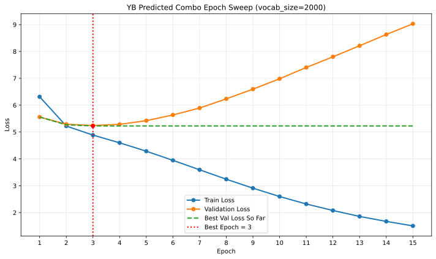

# YB 실험 결과: 예측 조합 검증

| 항목 | 내용 |
| --- | --- |
| 담당자 | 영빈 |
| 실험 목적 | A~C 결과의 경향을 바탕으로 예측한 조합 검증 |
| 비교 대상 | `vocab_size=2000` vs `vocab_size=3000` |
| 실행 방식 | `experiments/scripts/_pretrain_runner.py`를 직접 호출한 단일 조합 실행 |

## 1. 실험 질문

기존 A~C 결과를 종합해 예측한 아래 조합이 실제로 유효한지 확인한다.

```text
context_length=64
emb_dim=192
n_layers=4
n_heads=4
batch_size=6
learning_rate=7e-4
drop_rate=0.0
weight_decay=0.0
warmup/cosine decay/clipping 미사용
num_epochs=3
```

이번 실험에서는 구조와 학습 설정은 고정하고 `vocab_size`만 바꿔 비교했다. `2000`은 기존 tokenizer 재사용 상태로 다시 실행해 `3000`과 공정 비교가 가능하도록 맞췄다.

## 2. 공통 환경

| 항목 | 값 |
| --- | --- |
| Colab GPU | Tesla T4 |
| Colab runtime | GPU, Latest |
| Python | 3.12.13 |
| PyTorch | 2.11.0+cu128 |
| CUDA | 12.8 |
| git commit | `3c4cf51` |
| seed | 42 |
| train_char_limit | 500000 |
| val_char_limit | 50000 |
| output root | `/content/drive/MyDrive/gpt-lab/experiment_outputs/pretrain/` |

## 3. 실행 설정

| 항목 | 값 |
| --- | --- |
| context_length | 64 |
| emb_dim | 192 |
| n_layers | 4 |
| n_heads | 4 |
| batch_size | 6 |
| learning_rate | 7e-4 |
| drop_rate | 0.0 |
| weight_decay | 0.0 |
| optimizer | AdamW |
| num_epochs | 3 |
| scheduler | 사용 안 함 |
| warmup | 사용 안 함 |
| gradient clipping | 사용 안 함 |

## 4. 결과 요약

| 실험 ID | vocab_size | tokenizer | best val loss | final global step | elapsed_min | 상태 | best checkpoint |
| --- | ---: | --- | ---: | ---: | ---: | --- | --- |
| `YB_pred_combo` | 2000 | 기존 tokenizer 사용 | 5.2275 | 2559 | 4.32 | keep | `/content/drive/MyDrive/gpt-lab/experiment_outputs/pretrain/YB_pred_combo_20260603_YEONGBEEN/checkpoints/YB_pred_combo_20260603_step2500_best.pt` |
| `YB_pred_combo_3000` | 3000 | 기존 tokenizer 사용 | 5.7709 | 2286 | 5.75 | keep | `/content/drive/MyDrive/gpt-lab/experiment_outputs/pretrain/YB_pred_combo_3000_20260603_YEONGBEEN/checkpoints/YB_pred_combo_3000_20260603_step2286_best.pt` |

## 4.1 epoch 확장 결과 요약

`vocab_size=2000` best 조합을 `epoch=4`부터 `epoch=15`까지 늘려 추가 확인했다.

| num_epochs | best val loss | final epoch val loss | 결론 |
| ---: | ---: | ---: | --- |
| 3 | 5.2275 | 5.2433 | 기준점, 현재 best |
| 4 | 5.2275 | 5.2863 | 개선 없음 |
| 5 | 5.2275 | 5.4237 | 과적합 시작 |
| 6 | 5.2275 | 5.6372 | 과적합 심화 |
| 7 | 5.2275 | 5.8945 | 과적합 심화 |
| 8 | 5.2275 | 6.2358 | 과적합 심화 |
| 9 | 5.2275 | 6.5974 | 과적합 심화 |
| 10 | 5.2275 | 6.9841 | 과적합 심화 |
| 11 | 5.2275 | 7.4045 | 과적합 심화 |
| 12 | 5.2275 | 7.8017 | 과적합 심화 |
| 13 | 5.2275 | 8.2132 | 과적합 심화 |
| 14 | 5.2275 | 8.6316 | 과적합 심화 |
| 15 | 5.2275 | 9.0314 | 과적합 심화 |

시각화:



위 그래프는 `vocab_size=2000` 조합을 `epoch=1~15`까지 확장했을 때의 train loss, validation loss, best validation loss 누적 추이를 함께 보여준다. 최저점은 `epoch=3`, `best val loss=5.2275`다.

## 5. 세부 기록

### 5.1 `vocab_size=2000`

| 항목 | 값 |
| --- | --- |
| experiment_id | `YB_pred_combo` |
| tokenizer 경로 | `/content/week14-team-05-gpt-lab/artifacts/tokenizers/nsmc_bpe_vocab2000_full.json` |
| tokenizer 처리 | 기존 tokenizer 사용 |
| metrics | `/content/drive/MyDrive/gpt-lab/experiment_outputs/pretrain/YB_pred_combo_20260603_YEONGBEEN/metrics/YB_pred_combo_20260603_metrics.jsonl` |
| log | `/content/drive/MyDrive/gpt-lab/experiment_outputs/pretrain/YB_pred_combo_20260603_YEONGBEEN/logs/YB_pred_combo_20260603.out` |
| output_dir | `/content/drive/MyDrive/gpt-lab/experiment_outputs/pretrain/YB_pred_combo_20260603_YEONGBEEN` |

epoch별 요약:

| epoch | train loss | val loss | best val loss |
| ---: | ---: | ---: | ---: |
| 1 | 6.3135 | 5.5593 | 5.5593 |
| 2 | 5.2236 | 5.2907 | 5.2701 |
| 3 | 4.8862 | 5.2433 | 5.2275 |

생성 샘플:

```text
영화중력을 해줌.
이거야 하는건지
재밌다. 근데 내가 본 영화
장에서 해결말이 필요없다운받아서 좋았습니다. 영화라고 생각할머지.ㅡ
내 인생이 되네요....미안나온
```

### 5.2 `vocab_size=3000`

| 항목 | 값 |
| --- | --- |
| experiment_id | `YB_pred_combo_3000` |
| tokenizer 경로 | `/content/week14-team-05-gpt-lab/artifacts/tokenizers/nsmc_bpe_vocab3000_full.json` |
| tokenizer 처리 | 기존 tokenizer 사용 |
| metrics | `/content/drive/MyDrive/gpt-lab/experiment_outputs/pretrain/YB_pred_combo_3000_20260603_YEONGBEEN/metrics/YB_pred_combo_3000_20260603_metrics.jsonl` |
| log | `/content/drive/MyDrive/gpt-lab/experiment_outputs/pretrain/YB_pred_combo_3000_20260603_YEONGBEEN/logs/YB_pred_combo_3000_20260603.out` |
| output_dir | `/content/drive/MyDrive/gpt-lab/experiment_outputs/pretrain/YB_pred_combo_3000_20260603_YEONGBEEN` |

epoch별 요약:

| epoch | train loss | val loss | best val loss |
| ---: | ---: | ---: | ---: |
| 1 | 7.0899 | 6.4067 | 6.4067 |
| 2 | 5.8887 | 5.8388 | 5.8388 |
| 3 | 5.3518 | 5.7709 | 5.7709 |

생성 샘플:

```text
영화도아니고... 아버지.
난 이영화는 98점 주고 본 사람들의 가능력이 잘하다는 것이다.
잼없다 정말 재미있게봤다..
아직도 좋네요... 개인,. 나머리아빠진실
```

### 5.3 `vocab_size=2000` epoch 확장

#### 요약 해석

- `epoch=3`에서 기록한 `best val loss 5.2275`가 `epoch=4~15` 전체에서 한 번도 갱신되지 않았다.
- `epoch=4`부터 final epoch val loss가 `5.2863`으로 반등했고, 이후 `5.4237`, `5.6372`, `5.8945`처럼 꾸준히 악화됐다.
- `epoch=10` 이후에는 val loss가 `6.9841`, `7.4045`, `7.8017`까지 올라 과적합 경향이 매우 분명해졌다.
- 따라서 이 조합의 적정 학습 길이는 `3 epoch` 근처로 보는 것이 맞다.

#### 대표 기록

| 실험 ID | num_epochs | best val loss | final epoch val loss | final global step | 비고 |
| --- | ---: | ---: | ---: | ---: | --- |
| `YB_pred_combo_e4` | 4 | 5.2275 | 5.2863 | 3412 | `step2500` best 유지, 개선 없음 |
| `YB_pred_combo_e5` | 5 | 5.2275 | 5.4237 | 4265 | `step2500` best 유지, 과적합 시작 |
| `YB_pred_combo_e6` | 6 | 5.2275 | 5.6372 | 5118 | `step2500` best 유지, 악화 지속 |
| `YB_pred_combo_e10` | 10 | 5.2275 | 6.9841 | 8530 | `step2500` best 유지, 과적합 심화 |
| `YB_pred_combo_e15` | 15 | 5.2275 | 9.0314 | 12795 | `step2500` best 유지, 장기 학습 비효율 명확 |

주요 epoch 종료 val loss:

| epoch | final epoch val loss |
| ---: | ---: |
| 3 | 5.2433 |
| 4 | 5.2863 |
| 5 | 5.4237 |
| 6 | 5.6372 |
| 7 | 5.8945 |
| 8 | 6.2358 |
| 9 | 6.5974 |
| 10 | 6.9841 |
| 11 | 7.4045 |
| 12 | 7.8017 |
| 13 | 8.2132 |
| 14 | 8.6316 |
| 15 | 9.0314 |

## 6. 비교 해석

현재 시점의 결론은 아래처럼 정리할 수 있다.

- `2000` 조합은 `best val loss 5.2275`로 두 실행 중 가장 낮은 validation loss를 기록했다.
- `3000` 조합은 `best val loss 5.7709`까지 꾸준히 감소해, 예측 조합의 방향성이 `3000`에서도 유지됐다.
- `2000`은 `3000`보다 학습 시간도 짧았고(`4.32`분 vs `5.75`분), final global step은 더 많았다(`2559` vs `2286`).
- `2000` 조합을 `epoch=4~15`로 연장했을 때 best val loss는 한 번도 더 낮아지지 않았고, epoch 종료 val loss는 꾸준히 악화됐다.

즉 이번 결과는 다음 세 가지를 동시에 보여준다.

- 예측 조합 자체는 유효하다.
- 같은 조합에서는 현재 `vocab_size=2000`이 성능과 시간 모두 더 유리하다.
- 이 조합의 최적 학습 길이는 현재 기준 `3 epoch` 근처로 보인다.

## 7. 최종 결론

현재 기준에서 다음 판단은 아래와 같다.

1. 현재 best 실험 결과는 `vocab_size=2000`의 `YB_pred_combo`다.
2. 제출 기준 정합성과 tokenizer 재사용 검증 측면에서는 `vocab_size=3000` 실행도 의미가 있다.
3. `epoch=4~15` 확장 결과상 성능 개선이 전혀 없었으므로, 같은 조합을 더 길게 학습하는 우선순위는 매우 낮다.
4. 다음 우선순위는 `learning_rate=1e-3` 같은 추가 파라미터 실험이나, `batch_size`/`drop_rate` 미세 조정이다.

따라서 현재 문서 기준의 공식 best 결과는 `YB_pred_combo (vocab_size=2000)`이고, `YB_pred_combo_3000`은 제출 연계용 검증 실험으로 기록한다.
