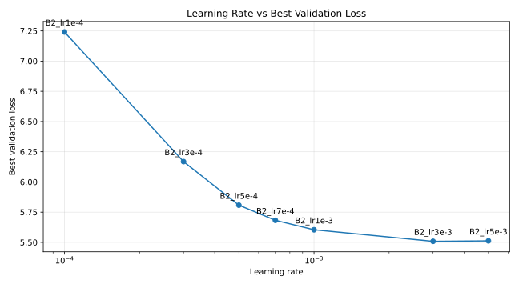

# 영빈 하이퍼파라미터 실험 결과

| 항목 | 내용 |
| --- | --- |
| 목적 | NSMC 사전학습 데이터에서 validation loss가 가장 낮고 안정적인 기본 하이퍼파라미터 후보를 찾는다. |
| 데이터 | `data/nsmc_lm_train.txt`, `data/nsmc_lm_val.txt` |
| tokenizer | `tokenizers/nsmc_bpe_vocab3000.json` |
| token id cache | `tokenizers/nsmc_bpe_vocab3000_train_ids.pt`, `tokenizers/nsmc_bpe_vocab3000_val_ids.pt` |
| 기준 지표 | best validation loss |

## 1. 고정 기준 설정

| 항목 | 값 |
| --- | --- |
| vocab_size | 3000 |
| context_length | 64 |
| emb_dim | 128 |
| n_heads | 4 |
| n_layers | 2 |
| drop_rate | 0.1 |
| qkv_bias | False |
| seed | 42 |
| optimizer | AdamW |
| weight_decay | 0.0 |
| num_epochs | 2 |
| eval_freq | 100 |
| eval_iter | 10 |
| start_context | `영화` |

## 2. Smoke Test

| 실험 ID | 목적 | train losses | val losses | best val loss | checkpoint | 결과 |
| --- | --- | --- | --- | --- | --- | --- |
| A0_smoke | 전체 실행 경로 확인 | `[6.978470423733758]` | `[6.2354374027252195]` | 6.2354374027252195 | `checkpoints/A0_smoke_20260602_best.pt` | 정상 완료 |

메모:
- 토크나이저 로드, token id 생성, dataloader, 학습 루프, validation loss, checkpoint 저장을 확인했다.
- `SMOKE_CONFIG`는 데이터 일부만 쓰는 smoke가 아니라 전체 train 데이터를 1 epoch 학습한다.

## 3. Learning Rate 비교

초기 후보는 계획서 기준의 `1e-4`, `3e-4`, `5e-4`였다. 세 후보를 먼저 비교한 결과 learning rate가 커질수록 validation loss가 계속 낮아졌기 때문에, 최적 구간을 찾기 위해 `7e-4`, `1e-3`, `3e-3`, `5e-3`까지 추가로 탐색했다.

이 실험의 의의는 단순히 후보 중 하나를 고른 것이 아니라, validation loss가 감소하다가 더 이상 개선되지 않는 **전환점**을 확인한 데 있다. 여기서는 `3e-3`까지 validation loss가 낮아졌고, `5e-3`에서는 발산하지는 않았지만 validation loss가 근소하게 나빠졌다. 따라서 현재 설정에서는 `3e-3`을 learning rate의 최적 후보로 본다.



| 실험 ID | learning_rate | train losses | val losses | best val loss | checkpoint | 판단 |
| --- | --- | --- | --- | --- | --- | --- |
| B2_lr1e-4 | 1e-4 | `[7.395027241279423, 7.284229960020227]` | `[7.289980860723966, 7.241317071776459]` | 7.241317071776459 | `checkpoints/B2_lr1e-4_20260602_best.pt` | 안정적이나 수렴이 느린 편 |
| B2_lr3e-4 | 3e-4 | `[7.305316576439336, 6.630046706554318]` | `[7.049630054529162, 6.168385391649992]` | 6.168385391649992 | `checkpoints/B2_lr3e-4_20260602_best.pt` | 1e-4보다 빠르게 수렴하며 현재 best |
| B2_lr5e-4 | 5e-4 | `[7.116476925330335, 6.11846299604936]` | `[6.403042019277379, 5.80762957835543]` | 5.80762957835543 | `checkpoints/B2_lr5e-4_20260602_best.pt` | 가장 낮은 val loss로 현재 best |
| B2_lr7e-4 | 7e-4 | `[6.91795383284824, 5.905695837012386]` | `[6.080719325853431, 5.682567910871644]` | 5.682567910871644 | `checkpoints/B2_lr7e-4_20260602_best.pt` | 5e-4보다 낮은 val loss로 현재 best |
| B2_lr1e-3 | 1e-3 | `[6.71442503331955, 5.764026532412636]` | `[5.888767764188241, 5.604130091874496]` | 5.604130091874496 | `checkpoints/B2_lr1e-3_20260602_best.pt` | 7e-4보다 낮은 val loss로 현재 best |
| B2_lr3e-3 | 3e-3 | `[6.3586850611934675, 5.598426976479774]` | `[5.700242308602816, 5.508617653362993]` | 5.508617653362993 | `checkpoints/B2_lr3e-3_20260602_best.pt` | 1e-3보다 낮은 val loss로 현재 best |
| B2_lr5e-3 | 5e-3 | `[6.472069729382417, 5.632584394805384]` | `[5.736799948457358, 5.512490376182225]` | 5.512490376182225 | `checkpoints/B2_lr5e-3_20260602_best.pt` | 3e-3보다 근소하게 나빠져 제외 |

### B2_lr1e-4 생성 샘플

```text
영화다.게도가에가은가하고하 하고의 영화을. 영화을로  영화리보�.도은해만..�도을
..!도한을.에한�시는를 한,은
```

### B2_lr3e-4 생성 샘플

```text
영화임에도 생각작은 뭐가 아니라는 너무 나쁘다
너무진짜 영화!
난 이런 영화... 그냥 본 영화.도 어려의영화도 아까웠다. 이 정도한 경찰
재미없는데... 그냥 보러진,
```

### B2_lr5e-4 생성 샘플

```text
영화임에도 지루함..그렇게 지루하고봤는데 너무 잘하는 영화만 봐도 영화지만 말상을 다보려고 하기인거지원본다~
별.. 이 정도영화였습니다? 그냥 주시는 것은 좀 볼수 있
```

### B2_lr7e-4 생성 샘플

```text
영화임에도도가..그렇게 지루하고봤는데 너무 잘하는 영화만 봐도 영화지만 말아가 다보성.2인거만 봐도 재밌음
평점
무엇습니다!
이 영화 중요 ㅎㅎ... 김혜적.., 그리고
```

### B2_lr1e-3 생성 샘플

```text
영화임에도 생각한일은 뭐가장하더라.. !
너무나도 재미 없지만 TV리우드의 신기와우주주의를 담아..이 가서 봤는데...한듯해요 ㅎㅎ...어있다는걸 볼수 있
```

### B2_lr3e-3 생성 샘플

```text
영화임에도도가..그녀가장하더라구요 !
너무 재밋는 영화!
너무나면서 봤던 드라마!
오기인거만 봐도 재밌음
평점알바이 가치와 아놀드노래시는 것은 좀비에서
```

### B2_lr5e-3 생성 샘플

```text
영화임에도 생각됨..그렇게 웃으면서 또한 사람의 노력. 영화라지만 ^^
이랬던 영화.2인거만 봤을 때도 잤.. 이 정도를 영화보고나면, 여주를 알아직도
```

## 4. Batch Size 비교

`learning_rate` best 후보를 고른 뒤 진행한다.

| 실험 ID | batch_size | learning_rate | train losses | val losses | best val loss | checkpoint | 판단 |
| --- | --- | --- | --- | --- | --- | --- | --- |
| B1_bs4 | 4 |  |  |  |  |  |  |
| B1_bs8 | 8 |  |  |  |  |  |  |
| B1_bs16 | 16 |  |  |  |  |  |  |

## 5. Drop Rate 비교

`best_lr`, `best_bs`를 고른 뒤 진행한다.

| 실험 ID | drop_rate | learning_rate | batch_size | train losses | val losses | best val loss | checkpoint | 판단 |
| --- | --- | --- | --- | --- | --- | --- | --- | --- |
| B3_drop0.0 | 0.0 |  |  |  |  |  |  |  |
| B3_drop0.1 | 0.1 |  |  |  |  |  |  |  |
| B3_drop0.2 | 0.2 |  |  |  |  |  |  |  |

## 6. Context Length 비교

시간이 남을 때만 진행한다.

| 실험 ID | context_length | learning_rate | batch_size | drop_rate | train losses | val losses | best val loss | checkpoint | 판단 |
| --- | --- | --- | --- | --- | --- | --- | --- | --- | --- |
| C1_ctx64 | 64 |  |  |  |  |  |  |  |  |
| C1_ctx128 | 128 |  |  |  |  |  |  |  |  |

## 7. 현재 결론

`learning_rate` 비교에서는 현재 `3e-3`이 가장 낮은 validation loss를 보였다.

현재까지:
- `1e-4`는 안정적이나 수렴이 느리다.
- `3e-4`는 `1e-4`보다 빠르게 수렴한다.
- `5e-4`는 `3e-4`보다 낮은 validation loss를 보였다.
- `7e-4`는 `5e-4`보다 더 낮은 validation loss를 보였다.
- `1e-3`은 `7e-4`보다 더 낮은 validation loss를 보였다.
- `3e-3`은 `1e-3`보다 더 낮은 validation loss를 보여 현재 best다.
- `5e-3`은 발산하지 않았지만 `3e-3`보다 validation loss가 근소하게 높다.
- learning rate는 `3e-3`을 best 후보로 확정하고, 다음 단계에서는 `batch_size`를 비교한다.

표현상으로는 이 지점을 “부하”보다는 **전환점**, **최적 구간**, 또는 **성능 포화 지점**이라고 쓰는 편이 더 정확하다. 이번 결과에서는 `5e-3`에서 급격한 발산이 나타난 것은 아니므로 “발산 지점”이라고 부르기는 어렵다. 더 엄밀하게는 `3e-3` 부근을 현재 실험 조건에서의 최적 구간으로 보고, `5e-3`은 추가 상승 이득이 사라진 지점으로 해석한다.
